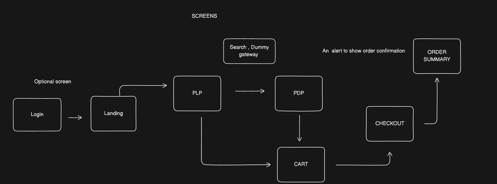

## E-commerce App

   

A learning assignment.

### High-Level Design

**CHECKLIST [TODO]:**

- [x] Listing Page
- [x] Adding Skeleton and animations
- [x] PDP flow
- [x] CART flow
- [x] Payment flow
- [x] Payment Success
- [x] Orders
- [ ] Dynamically update Count of Items in cart.
- [ ] Adding custom fonts
- [x] Redux-persist and saga setup.
- [ ] Introducing LocalDB(json-server) for handling more data at server-side.
- [ ] Creating and managing profile screen.
- [x] Login and SignUp functionality and mapping the users info in the localDB.
- [ ] Landing Page
- [ ] Incremental styling fixes.
- [ ] Adding and updating the Qty feature.
